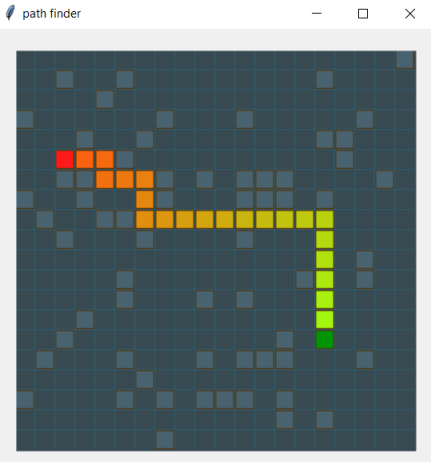

## Path Finder

Some experiments with DFS, Dijkstra and **AStar**.

Using minimal Python3 and drawing on a tkinter canvas.
Specifically, it is to experiment with methods, not to demonstrate a finished product.

I will also experimenting with animation loops in tkinter using root.after().
Actually, it's surprising how fast and smooth the amination can be...

 
 

+ show_grid uses grid_search for find a path.

+ snake_template is a simple snake game that wraps around and doesn't die when the snake goes over itself.

+ random_walker is a random walk around the grid.  The idea is to progress to more useful tasks.

>**Bruce Wernick**
> 
>_August 2021, TechniSolve Software_
>
